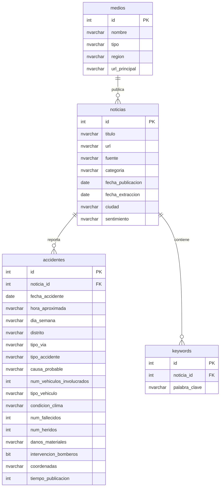

# Diagrama Entidad-Relación - Sistema Incidentes Tacna

## Vistas y Procedimientos
- **vw_accidentes_por_distrito**
- **vw_noticias_accidentes**
- **vw_estadisticas_tipo_accidente**
- **sp_buscar_por_keyword**
- **sp_resumen_mensual**
