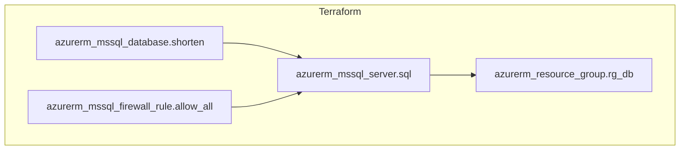
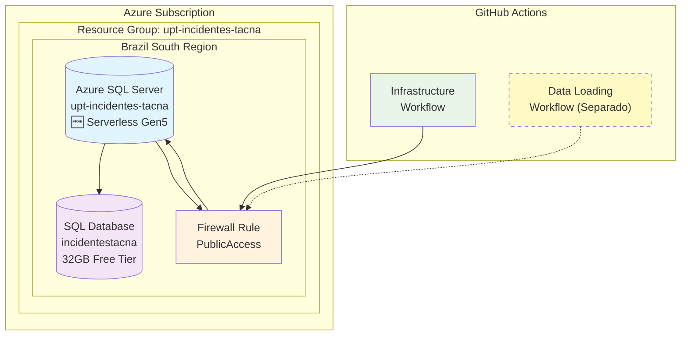

# Diagrama de Infraestructura Azure

Este diagrama muestra la arquitectura de la infraestructura desplegada en Azure usando Terraform.

## Diagrama Terramaid

## Diagrama de Arquitectura

## Componentes Desplegados

### Resource Group: `upt-incidentes-tacna`
- **Región:** Brazil South
- **Propósito:** Contenedor de recursos para sistema de incidentes Tacna

### SQL Server: `upt-incidentes-tacna`
- **Tipo:** Azure SQL Server
- **Versión:** 12.0
- **Autenticación:** SQL Server Authentication
- **Firewall:** Acceso público (0.0.0.0-255.255.255.255)

### Database: `incidentestacna`
- **SKU:** GP_S_Gen5_2 (🆓 **Tier Gratuito Serverless**)
- **vCores:** 0.5 - 2 (escalado automático)
- **Almacenamiento:** 32GB incluidos gratis
- **Auto-pause:** Después de 60 minutos sin uso
- **Propósito:** Almacenar noticias de incidentes y accidentes en Tacna

## 💰 Costos (Tier Gratuito)

- **100,000 vCore segundos/mes gratis** (~35 horas de uso continuo)
- **32GB de datos incluidos**
- **32GB de backup storage incluidos**
- **Costo adicional:** $0 dentro de los límites gratuitos

## Estado de la Infraestructura

✅ **Infraestructura desplegada exitosamente con tier GRATUITO**

### Próximos Pasos
1. ⏳ Ejecutar workflow de carga de datos por separado
2. 🔍 Consultar datos una vez cargados
3. ✅ Scripts SQL ya compatibles con T-SQL (SQL Server)

### Configuración SQL Server
- **Motor de BD:** SQL Server (T-SQL)
- **Puerto:** 1433
- **Connection string:** Formato SQL Server
- **Collation:** SQL_Latin1_General_CP1_CI_AS (compatible con español)

---
*Generado automáticamente el $(date)*
